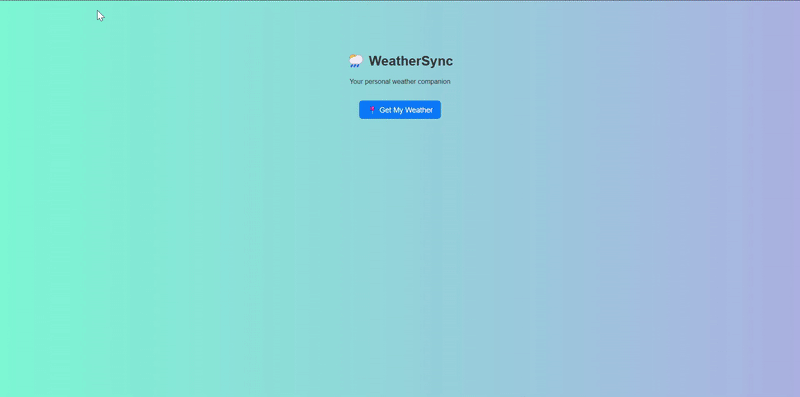
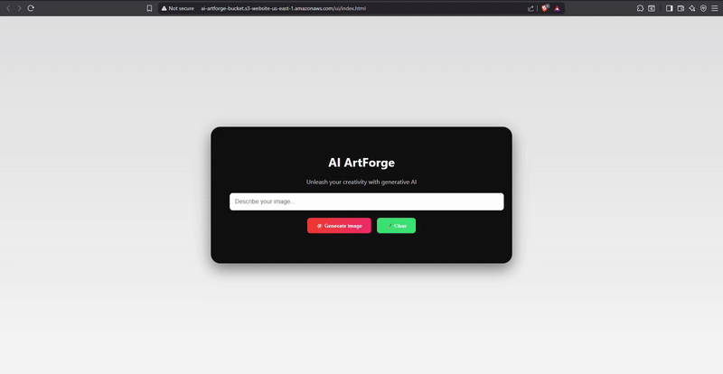
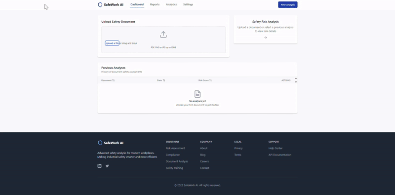
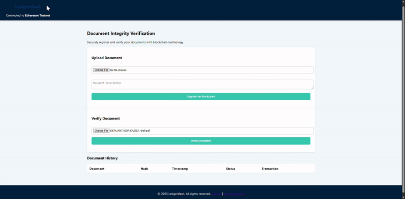

<h1 align="center">👋 Welcome to my GitHub Profile</h1>

  <em>Turning cloud ideas into secure, real-world solutions.</em> 
  <strong>Cloud Innovator | AWS Certified | Security Enthusiast</strong>

---

## 🧠 About Me

Cloud computing is more than just technology—it's how I turn ideas into real, impactful solutions.  
For me, it's a space where learning, building, and innovation come together.

**Work in Progress, Driven by Passion**  
As a final‑year Computer Science student, I cut my teeth building dynamic websites with React front‑ends and lightweight backends—delivering tailored solutions for individual clients and small businesses.  
Through self‑driven projects, I discovered how cloud computing can scale, secure, and elevate everything I build.

**Security‑Driven Exploration**  
I didn't just want to build apps—I wanted to **secure them**.  
By applying threat modelling, IAM best practices, encryption, and automated checks, I embraced the full potential of AWS.

**Always Improving**  
Holding certifications like **AWS SAA**, **Security Specialty**, **SysOps**, and **CompTIA Security+**, I’ve built strong foundations—then solidified them through real projects and hands-on labs.

---

## 🛠️ Technical Skills

### ☁️ Core AWS Services
Lambda • S3 • EC2 • RDS • API Gateway • DynamoDB • Route 53

### 🔐 Security & Identity
IAM • Cognito • KMS • GuardDuty • AWS Config • Secrets Manager • WAF

### 📈 Monitoring & Ops
CloudWatch • Systems Manager • Trusted Advisor • SNS

### ⚙️ DevOps & IaC
Git • CodePipeline • CloudFormation • Terraform

### 🏗️ Infrastructure
VPC • Subnets • Load Balancers • Auto Scaling • NAT Gateway • Bastion Hosts

### 🤖 AI & NLP
Textract • Comprehend • OpenAI API (GPT-4)

### 🎨 Frontend & Dev
React • Tailwind CSS • TypeScript • Docker • Mapbox • Ethereum/Infura

---

## 📚 Continuing Education

🧪 Hands-on labs on AWS Skills Builder  
📅 Regular webinars and security workshops  
🧭 Always exploring new AWS services (Bedrock, CloudTrail Lake, Step Functions...)

---

## 🚀 Featured Projects

| Project | Description | GitHub |
|--------|-------------|--------|
| **Cloud Security Monitoring** | Multi-Environment Threat Detection with CloudTrail Lake, Athena, Step Functions, QuickSight | [🔗 GitHub](https://github.com/davidnfizionly/cloud-security-monitoring) |
| **LedgerVault** | Immutable Document Verification (S3, Infura, Lambda, SHA-256) | [🔗 GitHub](https://github.com/davidnfizionly/ledgervault) |
| **AfyaSmart** | AI Health Symptom Checker with GPT-4, Lambda, API Gateway | [🔗 GitHub](https://github.com/davidnfizionly/afyasmart) |
| **SafeWork AI** | Industrial Risk Detection via Textract, Comprehend & EC2 | [🔗 GitHub](https://github.com/davidnfizionly/safework-ai) |
| **WeatherSync** | Smart Weather App (OpenWeatherMap + Lambda + Location Service) | [🔗 GitHub](https://github.com/davidnfizionly/weathersync) |
| **AI ArtForge** | AI Image Generator via Amazon Bedrock (Stable Diffusion) | [🔗 GitHub](https://github.com/davidnfizionly/ai-artforge) |

---

## 🎬 Project Previews

<table>
  <tr>
    <td align="center"><b>WeatherSync</b> </td>
    <td align="center"><b>AfyaSmart</b> </td>
  </tr>
  <tr>
    <td align="center"><b>AI ArtForge</b> </td>
    <td align="center"><b>SafeWork AI</b> </td>
  </tr>
  <tr>
    <td align="center"><b>LedgerVault</b> </td>
  </tr>
</table>

---

## 🤝 Connect with Me

  
🌍 Portfolio coming soon

---
